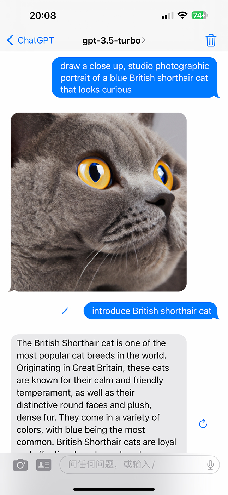
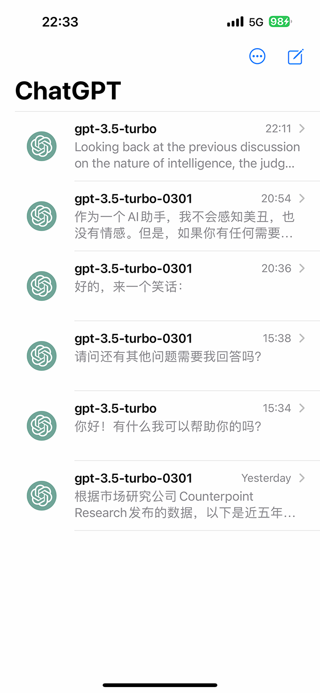
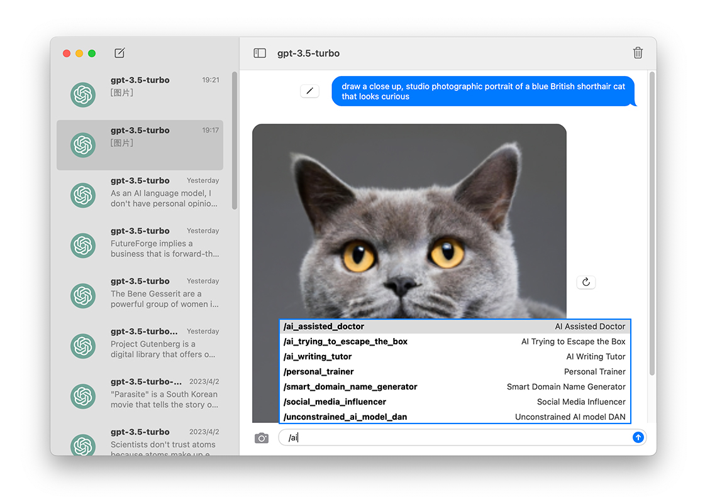

# GPTMessage
A SwiftUI app demonstrating ChatGPT and DALL·E with an iMessage-like UI for iOS and macOS.

This is what the app looks like on iOS:
<p float="left">
  
   
</p>

And macOS:
<p float="left">
  
</p>

## Feautures
### Chat Completion

Chat Completion is driven by OpenAI's chat language models, including gpt-3.5-turbo and gpt-3.5-turbo-0301.
### Image Generation

Image Generation uses OpenAI's image generation API(DALL·E) to create images.

To start drawing, simply send a message beginning with "Draw". For example, you could say `Draw a close-up, studio photographic portrait of a curious-looking blue British Shorthair cat`.

## Prompts

Default prompts come from **[Awesome ChatGPT Prompts](https://github.com/f/awesome-chatgpt-prompts)**.

### iOS

Click the person icon or type '/' to show the prompts list.

### macOS

Type '/' to show the prompts list.

## Usage

Set your OpenAI API key in the AppConfiguration.

```swift
class AppConfiguration: ObservableObject {
        
    @AppStorage("configuration.key") var key = "OpenAI API Key"
    
}
```
