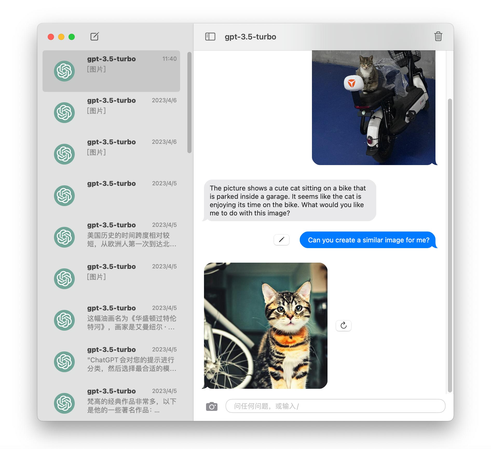
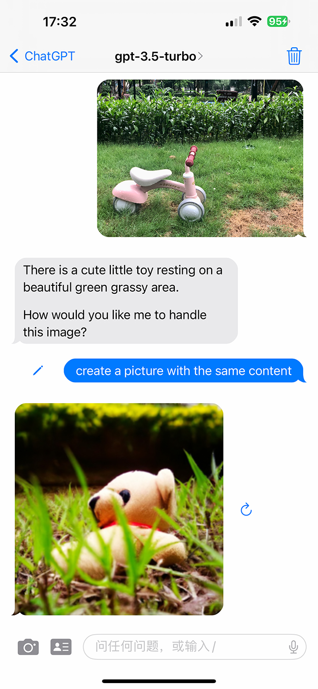

# GPTMessage
A SwiftUI app demonstrating how ChatGPT interacts with DALL·E and HuggingFace models for iOS and macOS.

This is what the app looks like on iOS:
<p float="left">
  
   
</p>

And macOS:
<p float="left">
  
</p>

## Feautures
### Chat Completion

Chat Completion is driven by OpenAI's chat language models, including gpt-3.5-turbo and gpt-3.5-turbo-0301.
### Image Generation

Image Generation uses OpenAI's image generation API(DALL·E) and HuggingFace's Inference API to create images.

To start drawing, simply send a message beginning with "Draw". For example, you could say `Draw a close-up, studio photographic portrait of a curious-looking blue British Shorthair cat`.

`Draw something` is a hardcoded prompt. However, when Smart Mode is enabled, ChatGPT will classify your prompt and select the most appropriate model to handle it. Therefore, you could ask, `Can you assist me in creating a close-up, studio photographic portrait of a curious-looking blue British Shorthair cat?`.

Hugging Face's Inference API is the preferred option since it's free(but slow). You can easily switch to DALL·E in the settings.

### Image Caption

By connecting ChatGPT with an Image Caption model such as [nlpconnect/vit-gpt2-image-captioning](https://huggingface.co/nlpconnect/vit-gpt2-image-captioning) from Hugging Face, we can easily integrate the image captioning task with the image generation task.

<p float="left">
  
</p>

<p float="left">
  
  
</p>

## Prompts

Default prompts come from **[Awesome ChatGPT Prompts](https://github.com/f/awesome-chatgpt-prompts)**.

### iOS

Click the person icon or type '/' to show the prompts list.

### macOS

Type '/' to show the prompts list.

## Usage

Set your OpenAI API key in the `AppConfiguration`.

```swift
class AppConfiguration: ObservableObject {
        
    @AppStorage("configuration.key") var key = "OpenAI API Key"
    
}
```

Set your Hugging Face User Access Token in the `HuggingFaceConfiguration`.

```swift
class HuggingFaceConfiguration: ObservableObject {
        
    @AppStorage("huggingFace.key") var key: String = ""
    
}
```
