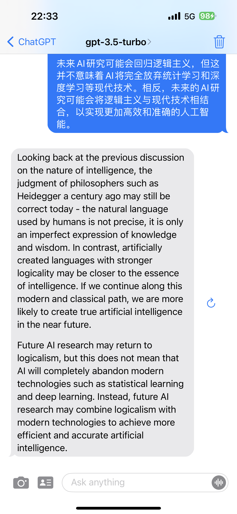
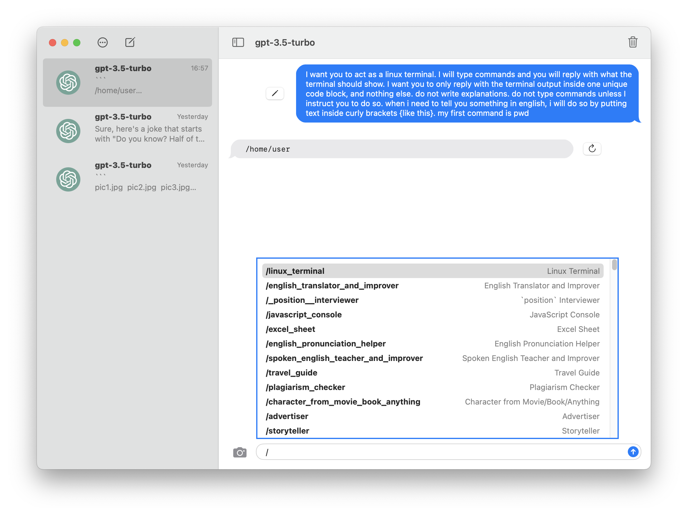

# GPTMessage
A SwiftUI app demonstrating ChatGPT with an iMessage-like UI.

This is what the app looks like on iOS:
<p float="left">
  
   
</p>

And macOS:
<p float="left">
  
</p>

## Usage

Set your OpenAI API key in the AppConfiguration.

```swift
class AppConfiguration: ObservableObject {
        
    @AppStorage("configuration.key") var key = "OpenAI API Key"
    
}
```
## Prompts

Default prompts come from **[Awesome ChatGPT Prompts](https://github.com/f/awesome-chatgpt-prompts)**.

### iOS

Click the person icon or type '/'.

### macOS

Type '/' to show the prompts list.
